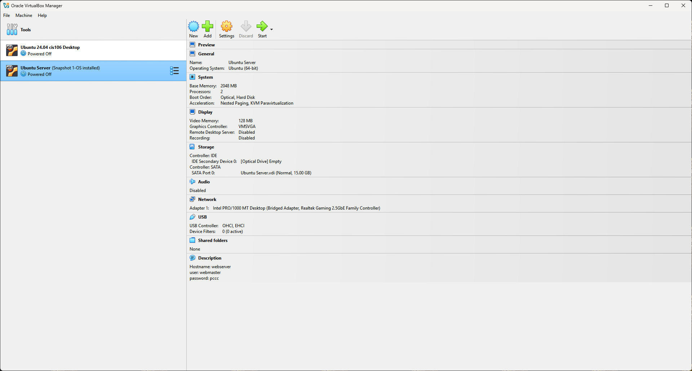
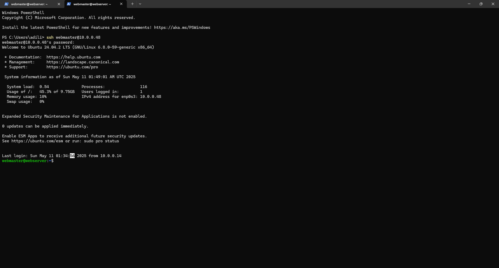

| Name           | Course  | Semester  | Instructor |
|----------------|---------|-----------|------------|
| Arjon Adili| CIS-106     | Spring 25 | R. Alberto |

## Deliverable 2 Submission

## Server Specifications

## Ubuntu Login Screen

## Questions

* What is the IP address of your Ubuntu Server Virtual Machine?
**Ip is 10.0.0.48**
  
* How do you enable the Ubuntu Firewall?
  **sudo ufw enable**

* How do you check if the Ubuntu Firewall is running?
**sudo ufw status**

* How do you disable the Ubuntu Firewall?
 **sudo ufw disable**

* How do you add Apache to the Firewall?
  **sudo ufw allow 'Apache'**

* What is the command you used to install Apache?
**sudo apt update sudo apt install apache2**

* What is the command you use to check if Apache is running?
  **sudo systemctl status apache2**

* What is the command you use to stop Apache?
**sudo systemctl stop apache2**

* What is the command you use to restart Apache?
**sudo systemctl restart apache2**
* What is the command used to test Apache configuration?
**sudo apache2ctl configtest**
* What is the command used to check the installed version of Apache?
**apache2 -v**
* What are the most common commands to troubleshoot Apache errors? Provide a brief description of each command.
* to check apache status and ensure its running correctly
**sudo systemctl status apache2**
*  Used for ensuring Apache files are correct
**apache2ctl configtest**

