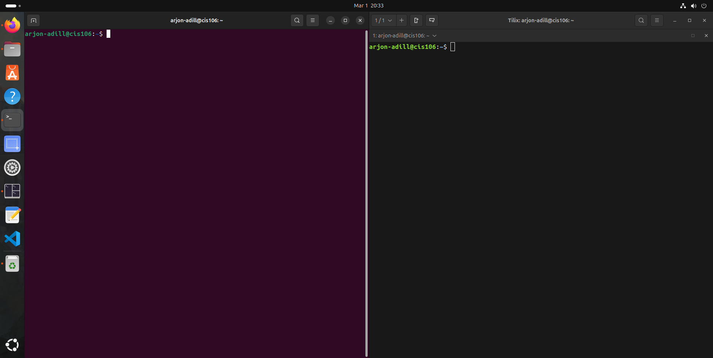
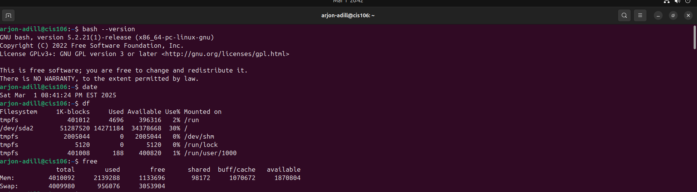
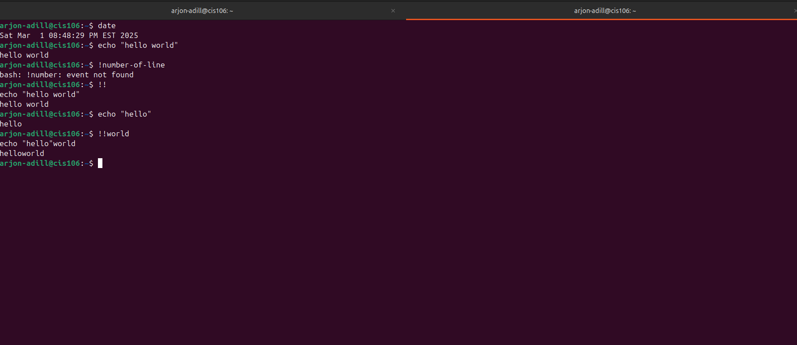
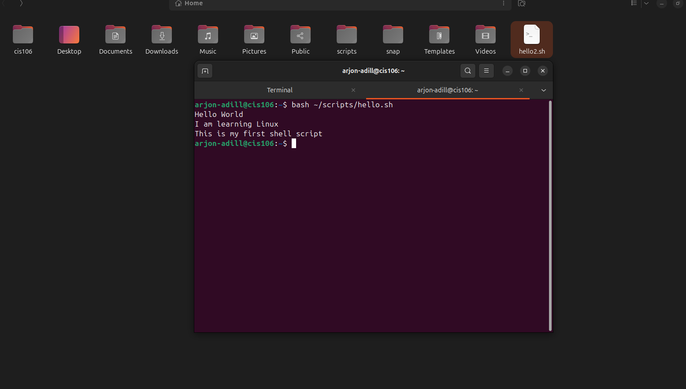
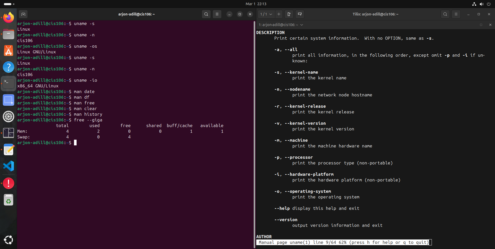
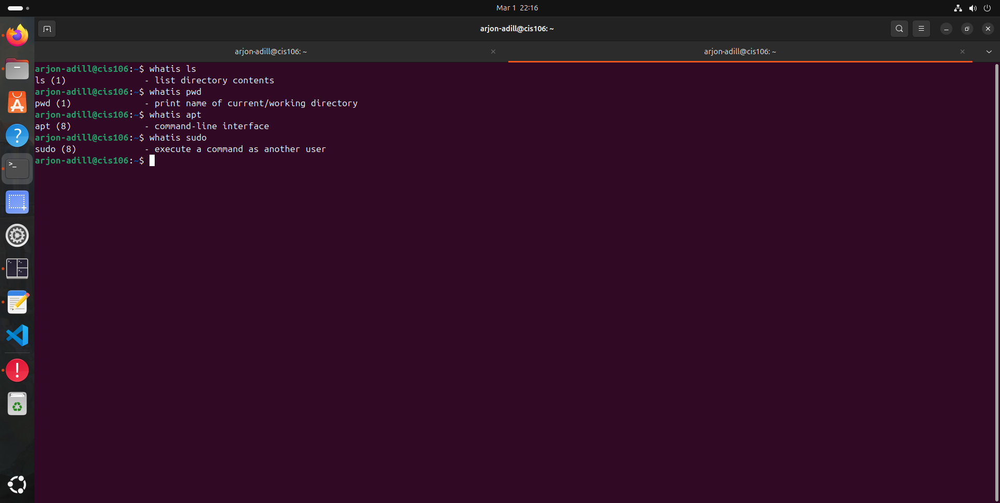
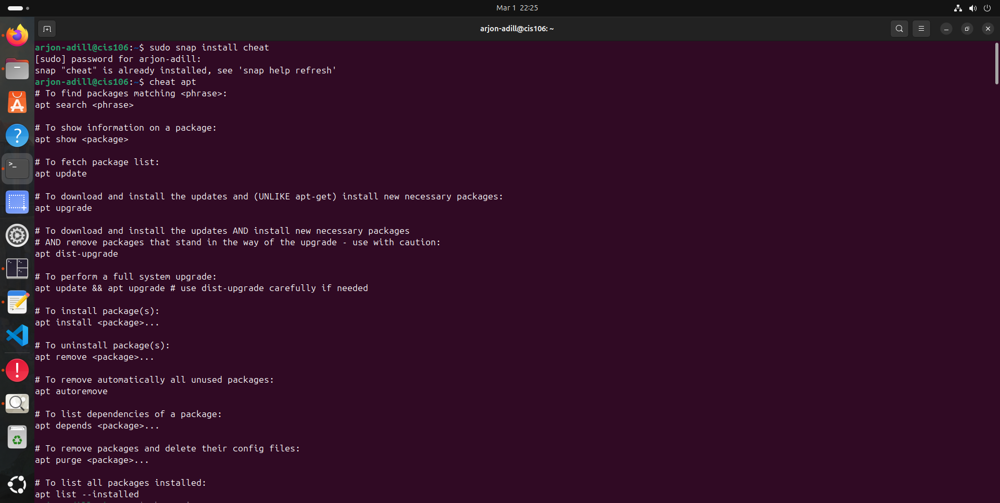

# Week Report 3

## Completed work Week 3
* [lab3](../../labs/lab3/lab3.md)
* [Notes3](../../notes/notes3/notes3.md)

## Practice
### Practice 1

### Practice 2

### Practice 3

### Practice 4

### Practice 5

### Practice 6

### Practice 7

### Practice 1 Managing Software

### Practice 2 Managing Software

